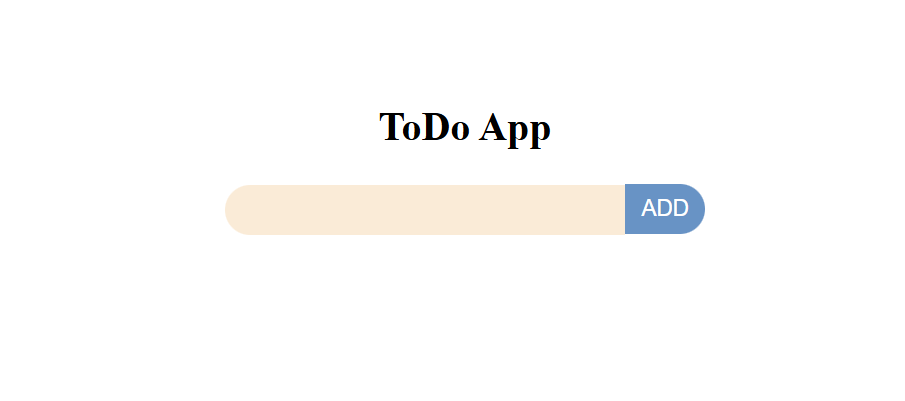
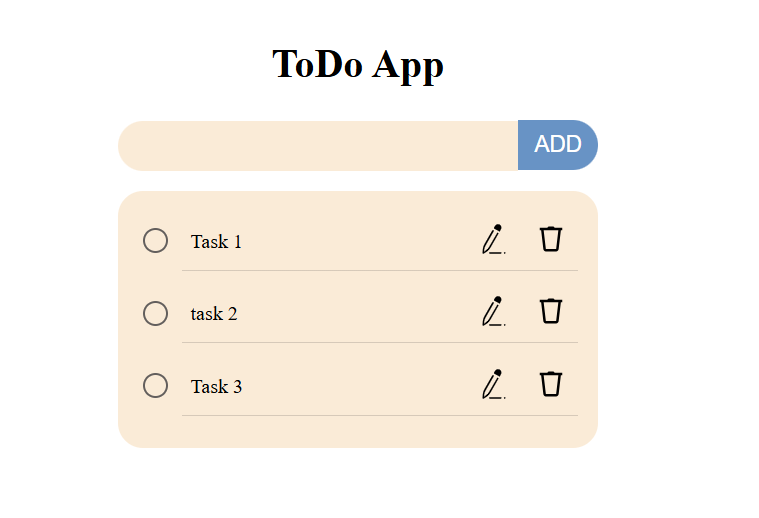
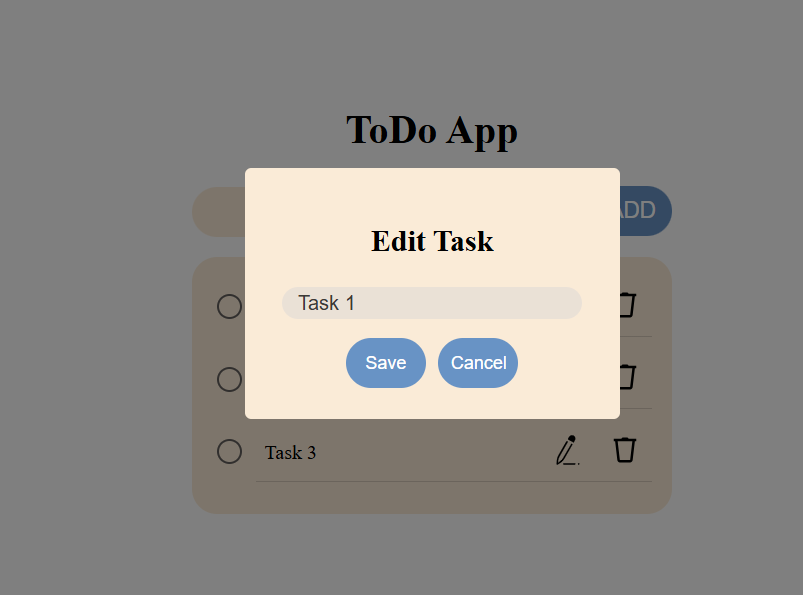

# Todo App - React + TypeScript

This is a simple Todo app built with React, and TypeScript. It allows users to add, complete, edit, and delete tasks from a list.

## Features

- Add tasks to the list
- Mark tasks as completed with a checkbox
- Delete tasks from the list
- Edit tasks from the list

## Installation and Setup

### 1. Clone the repository
First, clone the repository using the following command:

```bash
git clone https://github.com/your-username/todoreact.git
```

### 2. Change to the project directory
Navigate to the project folder (UI directory):

```bash
cd todoreact/ui
```

### 3. Install dependencies
Install the necessary dependencies by running:

```bash
npm install
```

This will install the dependencies required to run the app, including React, TypeScript, and Vite.

### 4. Run the Vite app
To start the development server and run the app, execute:

```bash
npm run dev
```

This will start the app on [http://localhost:5173](http://localhost:5173) (or another port if 5173 is in use).

### 5. Open the app in your browser
Once the server starts, you can open the app in your browser by navigating to the URL provided in the terminal (typically `http://localhost:5173`).

## Usage

- **Add Task**: Enter text in the input field and click the "Add Task" button to add a new task to the list.
- **Mark as Completed**: Click the checkbox next to a task to mark it as completed. The task text will be crossed out.
- **Delete Task**: Click the trash icon next to a task to remove it from the list.
- **Edit Task**: Click the pencil/edit icon next to a task to edit its text.


## Screenshot

Here are some screenshots of the Todo app:

- **Add Task**:
  

- **List Tasks**:
  

- **Edit Task**:
  

## How It Works

- **Add Task**: Type the task in the input field and click the "Add Task" button to add it to the list.
- **Mark as Completed**: To mark a task as completed, check the checkbox next to the task. The task text will be crossed out to indicate completion.
- **Delete Task**: Click the trash icon next to any task to delete it from the list.
- **Edit Task**: Click the pencil/edit icon next to a task to edit its text.

## Development

- **Hot Reloading**: Vite provides fast hot module replacement (HMR) for quick feedback during development.
- **TypeScript**: TypeScript is used for type safety and better development experience.
